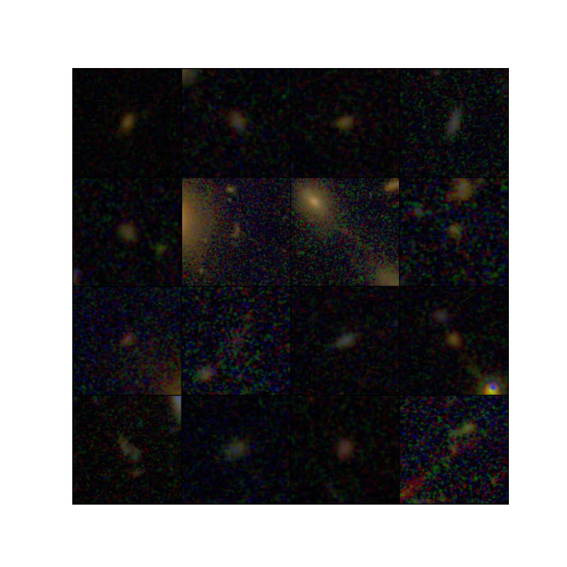

# Galaxy Zoo CANDELS Project

This is my repository for the DSCI 410 Project Milestone.

## Project Overview

This project uses the Galaxy Zoo:
CANDELS (or GZ: CANDELS) dataset to de-noise, cluster, and classify galaxies based on their visual features using an autoencoder and contrastive learning.

## Data Overview

The dataset was created using data collected by CANDELS
(Cosmic Assembly Near-infrared Deep Extragalactic Legacy Survey)
and volunteers from the Galaxy Zoo project who classified tens of thousands of galaxy images from this mission alone.
Each image has an associated identifier, metadata, and vote fractions from the volunteers for each classifier.

## Methods Overview

[TODO]

## Results

[TODO]

## Conclusion

[TODO]
