# Galaxy Zoo: Hubble Project

This is my repository for the DSCI 410 Final Project.

## Project Overview

This project uses the Galaxy Zoo: Hubble (or GZ:H) dataset to de-noise, reconstruct, and cluster
images of galaxies using their visual features via an autoencoder and contrastive learning.

## Data Overview

The dataset was created using data collected by the Advanced Camera for Surveys (ACS) aboard the
Hubble Space Telescope (HST) and a community of more than 80,000
volunteers who classified galaxies.
It contains nearly 120,000 images of galaxies, each with an
associated identifier, metadata, and vote fractions generated from the volunteers.
Although the
volunteer data was not used in this project, it may be useful to incorporate few-shot learning
techniques or examine the clusters more closely.

The original data from the Galaxy Zoo project can be
found [here](https://data.galaxyzoo.org/#section-11), and the GitHub repository I used to download
the images can be found [here](https://github.com/mwalmsley/galaxy-datasets).

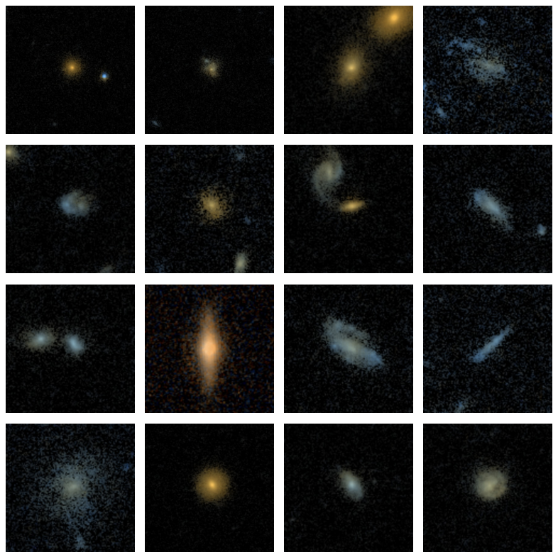

## Methods Overview

The core component of each model is an autoencoder with a projection head attached that's used for
contrastive learning.

The autoencoder using binary image masking to separate the foreground (the galaxy) from the
background, which is then used to calculate separate loss functions for each component.
The background of each image uses a combination of total variation loss and a "darkening" loss.
The foreground uses SSIM (Structural Similarity Index Measure) loss.
The total autoencoder loss is the combination of the background and foreground losses.

For the contrastive learning, NT-Xent (Normalized Temperature-Scaled Cross-Entropy) loss is used,
which is then combined with the total autoencoder loss to obtain the loss for the entire model.

**The pre-processing pipeline:**

1. Take a "clean" image (C)
2. Duplicate C and apply random geometric transforms (C1, C2)
3. Duplicate C1 and C2 and add artificial noise (Poisson + Gaussian) to get the "noisy" images (N1,
   N2)
4. Using C1 and C2, calculate the binary image masks (M1, M2)

Below is a look of what one component of the dataset looks like (two clean images, two noisy
images, and two masks).
For each of the images in the training dataset (~80,000), the following is created:

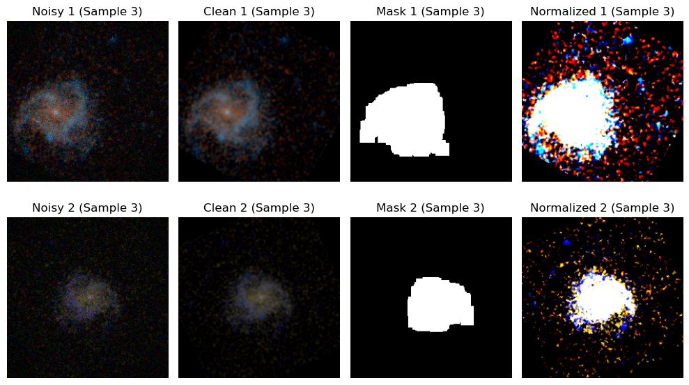

**A basic overview of the model steps:**

- **Autoencoder:**
    - Feed in N1 --> reconstruct C1
    - Feed in N2 --> reconstruct C2
- **Contrastive Learning:**
    - Treat N1 and N2 as the positive pair
    - Since it is unsupervised/self-supervised, we do not have any explicit negative pairs
        - The other images are implicitly treated as such

## Training the Model(s)

1. **Prepare the Environment:**
    1. Ensure all required packages are installed.
    2. The device should automatically be configured using `device_checker()`.
    3. Verify the dataset is either placed in the correct directory or choose to install it using `fresh_download=True` in `load_original_datasets()`.

2. **Configure Data:**
    1. The script automatically loads and preprocesses the data using `dataset.py`.
    2. Tune the noise and augmentations added to the images using the `create_transforms()` parameters.
    3. Tune the dataloaders using the `get_data_loaders()` parameters.
        1. **Note:** The U-Net-Style model is computationally demanding, start with smaller batch sizes and increment from there (if necessary).

3. **Configure Model:**
    1. The script automatically loads the models using `models.py`.
    2. Two model types are defined (`UNetContrastiveAAutoencoder` and `CustomContrastiveAAutoencoder`). Choose which one to train by selecting the appropriate model instance.
    3. For the custom model, you may set the output latent dimensions using `latent_dims`, and a specific activation function to be used in each layer using `activation_type`.
        1. The choices are the following: 'relu', 'leaky_relu', 'prelu', 'elu', 'selu', 'gelu', and 'softplus'.

4. **Configure Training Hyperparameters:**
    1. General hyperparameters: `num_epochs`, `learning_rate`, and `early_stop`.
    2. Autoencoder hyperparameters that influence the loss weights: `lambda_galaxy` and `lambda_background`.
    3. Contrastive learning hyperparameters: `contrast_weight` and `contrast_temperature`.
        1. `contrast_weight` controls how much weight should be given to the contrastive loss in comparison to the reconstruction loss.
    4. Miscellaneous hyperparameters: `log_train_val_history` and `save_model`.
        1. **Note**: if `log_train_val_history=False`, you must remove the `train_history` and `val_history` assignments before calling `training_loop()`.

5. **Run the Training Loop:**
    1. Simply execute the script (i.e. run `train_models.py`).
    2. The training loop will iterate through the dataset, display progress, and (optionally) log performance metrics for each epoch using both the training and validation sets.
    3. After training, the model can be plotted to visualize trends over the training epochs using `plot_train_val_metrics()`
        1. **Note:** `log_train_val_history=True` must be set to plot.

## Results

Denoising/Reconstruction:

- Foreground SSIM score of ~0.96
    - Value of 1 is considered "perfect"

Fundamentally, autoencoders cannot reconstruct images that are cleaner than the target images—they
can only reduce the amount of noise to that which is present in the target images.
Thus, since we do
not have access to a subset of ultra-clean galaxy images, and we instead use *all* galaxy images for
the autoencoding, the autoencoder would normally only learn how to remove the artificial noise
introduced to the input images during the pre-processing stage.
That being said, through the clever
use of the binary image masks and specific loss functions, this model's autoencoder *does* learn how
to remove the noise found in the background of the image.
The noise that overlaps the galaxies
themselves still largely remains intact for the reasons mentioned above, however.

Below are some examples of how the model de-noises and reconstructs the input images.:

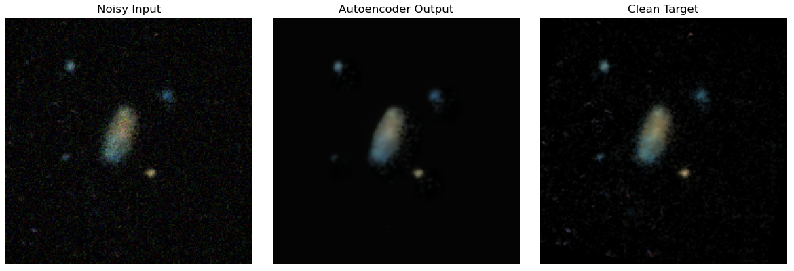
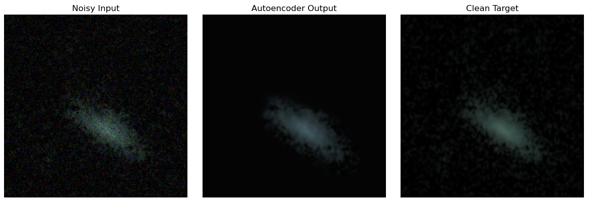
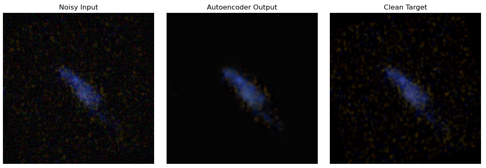

**Clustering:**

- HDBSCAN with three clusters:
    - Silhouette Score of ~0.48
- K-means with eight clusters:
    - Silhouette Score of ~0.23
- Values range from –1 to +1, where:
    - 0.25 = "weak"
    - 0.50 = "moderate"
    - 0.70 = "strong"

Below are the UMAP and t-SNE visualizations of the clusters identified by HDBSCAN. As you can see,
there are three distinct clusters that indicate the contrastive learning worked:

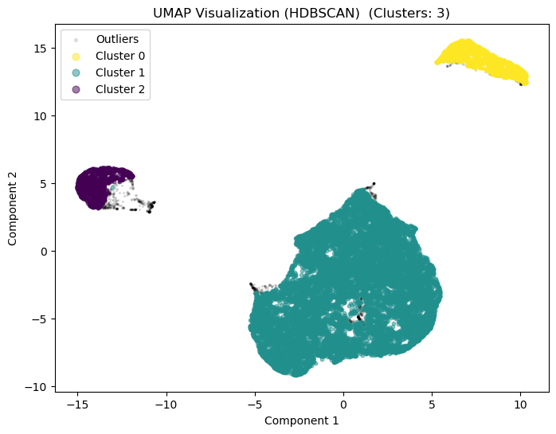
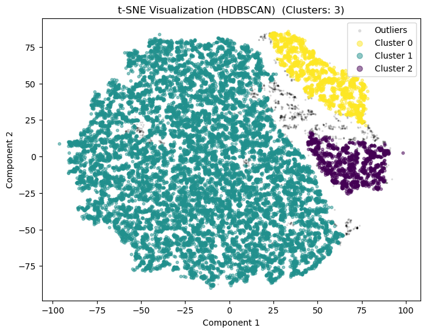

Below are some example images from each cluster identified by HDBSCAN. There appears to be some
color similarity and perhaps slight structure/shape similarity among each cluster, which indicates
that perhaps the model has focused too much on color rather than structure. Although color may be a
useful tool for classifying galaxy morphology, it likely is not as important as structure and could
be a confounding variable:

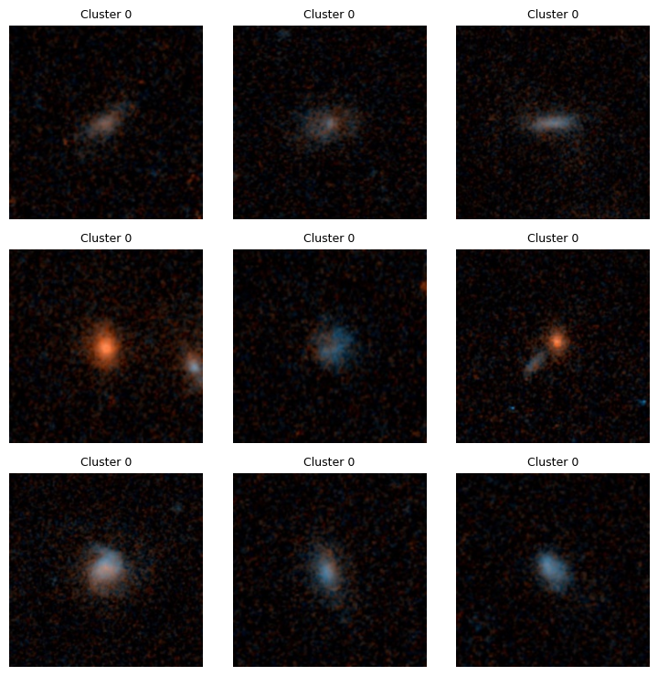
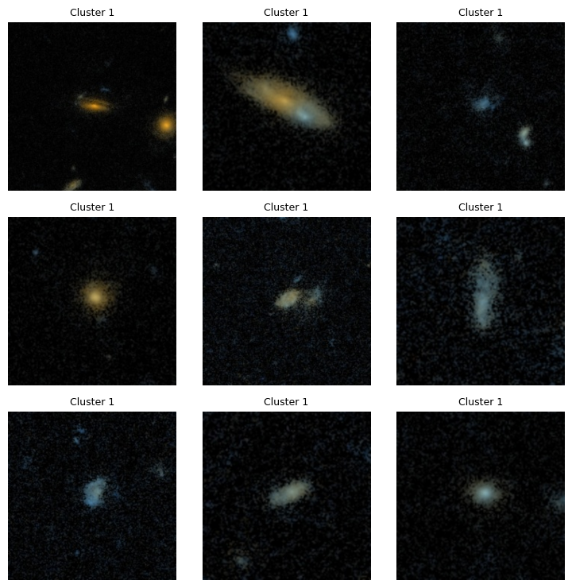
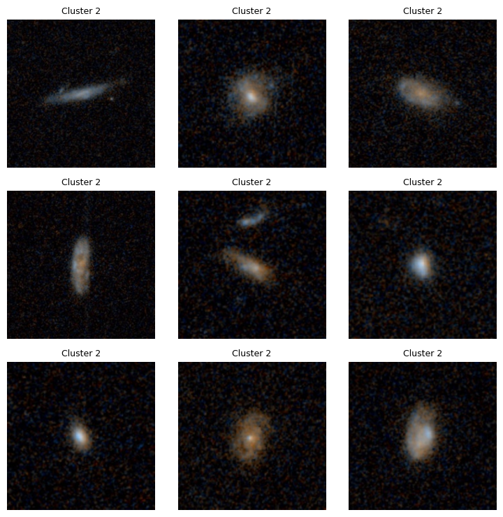

## Conclusion

**Outcomes:**

- Reconstructions were consistently really good
- Denoising was solid with some minor imperfections/artifacts
- Clustering/latent space representations were decent considering it did not have access to labeled
  data

I had initially hoped my clusters would more closely resemble the different galaxy morphology
classifications like the one below from another, more recent, Galaxy Zoo project named Galaxy Zoo:
DECaLS:

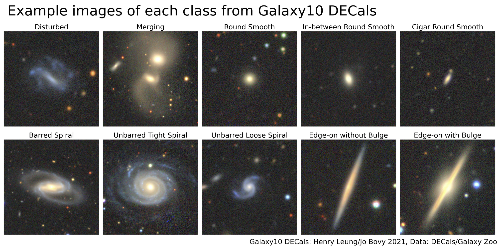

Although contrastive learning did help make the latent space representations more robust, this
proved to be quite challenging without introducing any labels. Additionally, these morphologies are
closely related and inherent qualities from each other, so it is often difficult to assign one
classification for each galaxy image. For example, see these images from the Galaxy Zoo: Hubble
project (Willett et al., 2016) visualizing the decision tree:

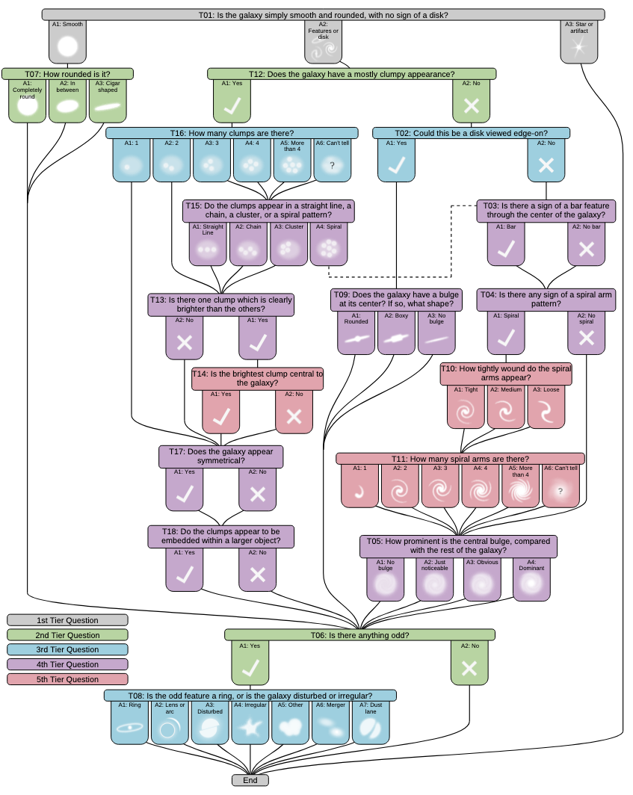
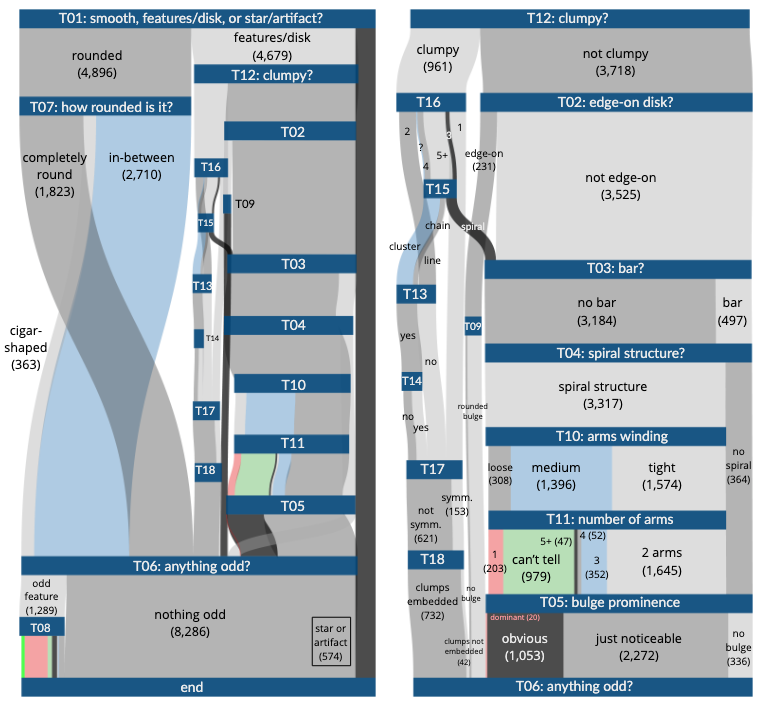

Although my initial goal was not met, my model still provides two useful tools while remaining
entirely unsupervised: cleaning images and clustering images. Additionally, depending on your
needs/goals, you could choose to use only one of these tools. By implementing some of the previously
mentioned changes or through further tuning, I believe this model could perform even better and
maybe even produce clusters that more closely resemble the morphology categories. Because only
self-supervision was used, this model could easily be adapted for use in any of the other projects
from Galaxy Zoo, such as GZ: 1, GZ: 2, GZ: CANDELS, GZ: DECaLS, and GZ: DESI.

## Acknowledgements

*U-Net: Convolutional Networks for Biomedical Image Segmentation*, Ronneberger et
al. [2015](https://doi.org/10.48550/arXiv.1505.04597)

*Galaxy Zoo: morphological classifications for 120,000 galaxies in HST legacy imaging*, Willet et
al. [2016](https://doi.org/10.48550/arXiv.1610.03068)

*A Simple Framework for Contrastive Learning of Visual Representations*, Chen et
al. [2020](https://doi.org/10.48550/arXiv.2002.05709)

The [galaxy-datasets](https://github.com/mwalmsley/galaxy-datasets) GitHub repository created by Dr.
Mike Walmsley, a prominent researcher involved in the Galaxy Zoo project.

I acknowledge Research Advanced Computing Services (RACS) at the University of Oregon for providing
computing resources that have contributed to the research results reported within this project.
URL: https://racs.uoregon.edu.
